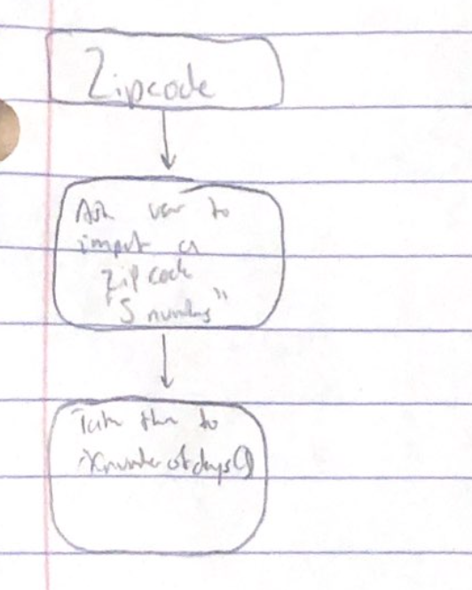
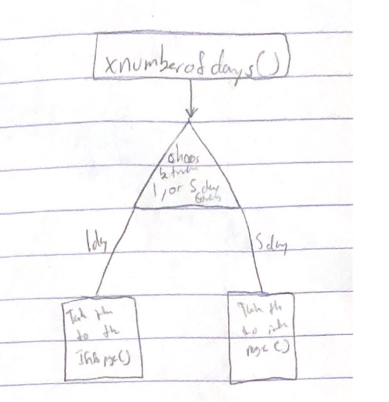
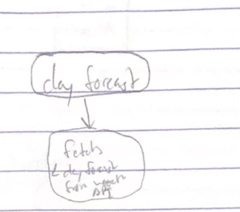
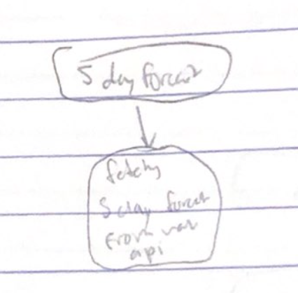
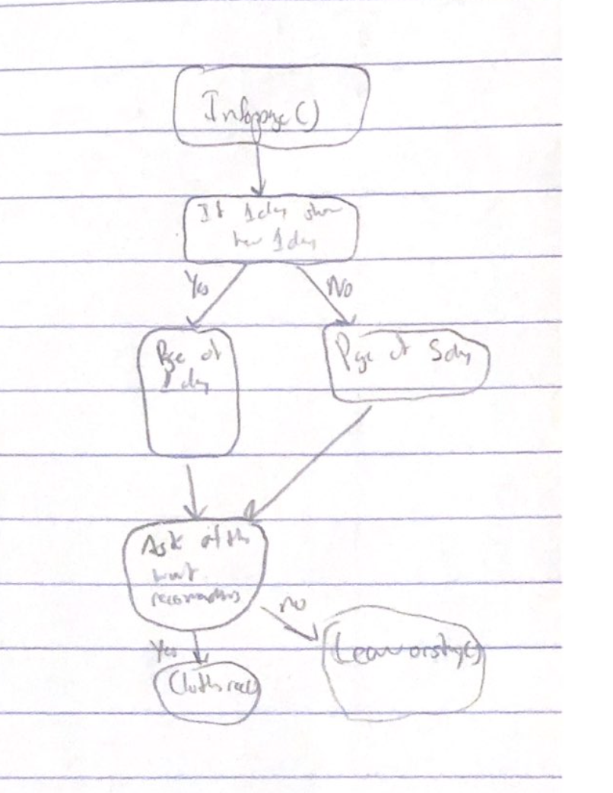
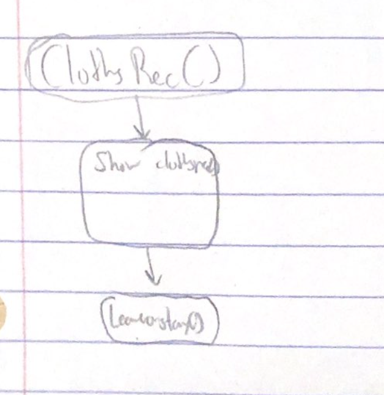
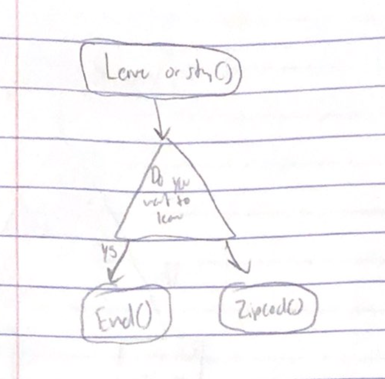

# Weatherorsomething™

## Description

Weatherorsomething™ is a app that shows what the weather for the next 5 days will be based on a zip code imputed by the user. 

## Overview

The purpose of Weatherorsomething™ is to show the weather. The user will input there zip code. The code is identified by a Weather API and
the weather is outputted and shown to the user. 

##  High Level Design 

1. Welcome Page
2. Also has box where the user writes there zip code.
3. This is where the Weather API does it thing
4. It then displays the weather for the person to see
5. Back button to start over

## Method List(What im gonna do)

### NavigationPage()
Start page for Weatherorsomething™

1. Start with a screen with the logo and a button that starts the program. 
2. If the user presses start then go to Zipcode().

### Zipcode()
Will have a place for user to input zip code (XXXXX)

1. The user will get the option to input their zipcode.
2. When they input the zipcode they should will be taken to Xnumberofdays()

### Xnumberofdays()
Asks user if they want 24 Hour weather, or week weather. 

1. Gives the player the option to see a 24 hour forecast or a 5 day forcast 
2. If 24 Hour Forecast run dayforecast().
3. if 5 day forecast run 5dayforecast().

### dayforecast()
Gets the forecast for 24 hours

1. Gets the forcaast for 24 hours
2. Displays it in InfoPage()

### 5dayforecast()
Gets the forecast for 5 days

1. Gets the forecast for 5 days.
2. Displays it in InfoPage()
3. Createst 

### InfoPage(weather)
Literally shows the weather

1. Displays the info sent by either dayforecast() or 5dayforecast()
2. Shows a button which if pressed sends user to ClothesRec()

### ClothesRec()
Recommends clothes based on weather. 

1. Reads the weather.
2. If 80-90 says wear shirts, if 70-80 wear a long sleeve etc. 

### Leaveorstay()
On the weather page have a leave button

1. If you click the button it will end the program
2. if 30 sec passes will start over. 

